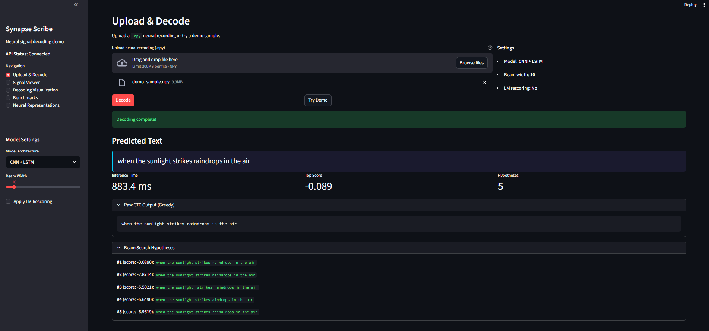
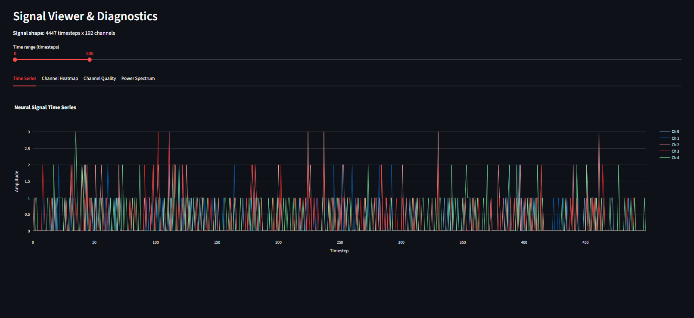
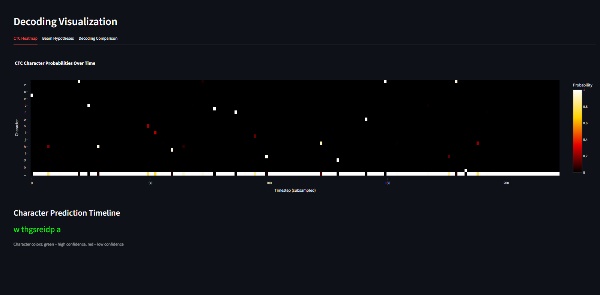
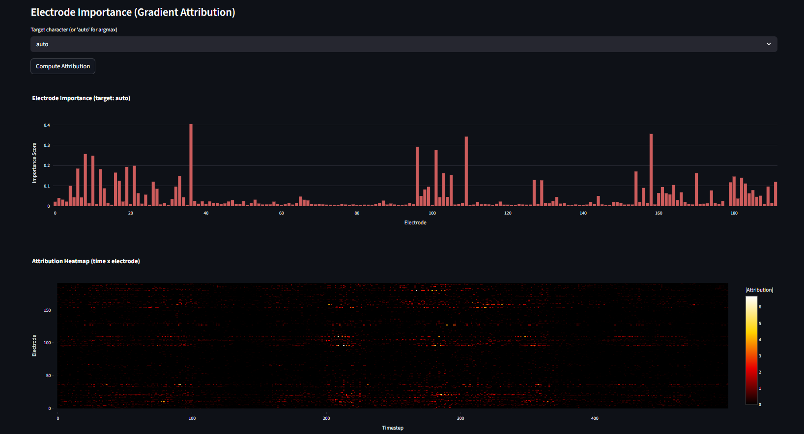
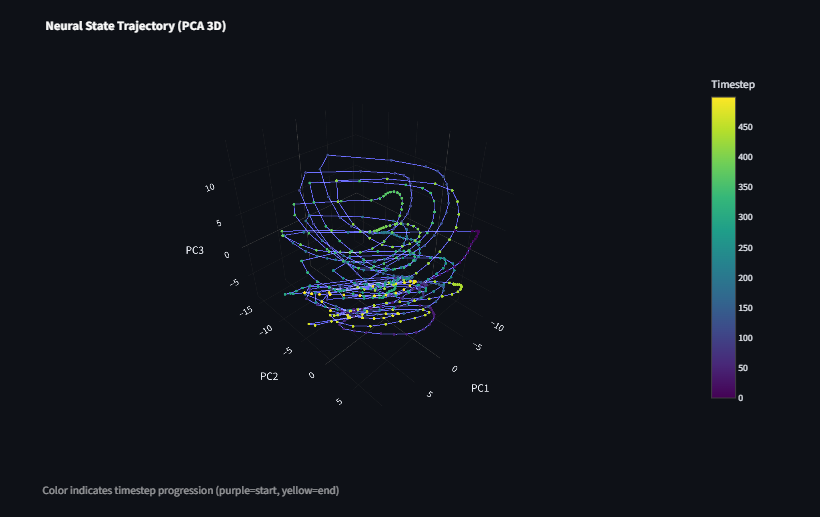
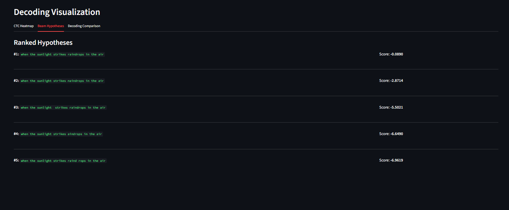
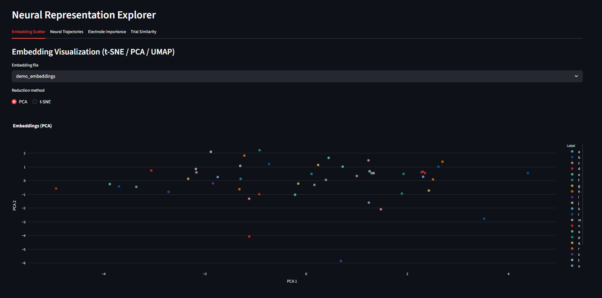

# Synapse Scribe: Brain-Text Decoder

Neural speech and handwriting BCI decoding system that converts brain recordings (ECoG/LFP) into text using CTC-trained sequence models.

<p align="center">
  
</p>

<p align="center">
  <em>Upload a neural recording, select a model, and decode brain activity into text — all from an interactive dashboard.</em>
</p>

## Architecture

```
Neural Recording (ECoG / LFP)
         |
    Preprocessing
    (bandpass, notch, z-score, resampling)
         |
    Feature Extraction
    +---------------------------+---------------------------+
    |  Pathway A                |  Pathway B                |  Pathway C
    |  Temporal Conv            |  Linear Projection        |  Firing-Rate Binning
    |  (1D convolutions)        |  + Positional Encoding    |  (Willett-style)
    +---------------------------+---------------------------+
         |                            |                           |
    +---------+    +----------+    +-------------+    +------------------+
    | CNN+LSTM |    |Transformer|    |CNN-Transformer|    |  GRU Decoder     |
    | (Model B)|    | (Model C) |    |  (Model D)    |    |  (Model A)       |
    +---------+    +----------+    +-------------+    +------------------+
         \              |               /                      /
          \             |              /                      /
           +------------+-------------+---------------------+
                                  |
                           CTC Decoding
                    (greedy / beam search + LM)
                                  |
                            Decoded Text
```

## Features

- **4 decoder architectures** -- GRU (Willett-style), CNN+LSTM, Transformer, Hybrid CNN-Transformer
- **CTC training & decoding** -- greedy search, beam search with configurable width, KenLM language model rescoring
- **Signal diagnostics** -- channel quality, SNR estimation, spectral analysis, trial quality, correlation reports
- **Preprocessing pipeline** -- bandpass/notch filtering, z-score normalization, resampling, segmentation
- **Data augmentation** -- time masking, channel dropout, Gaussian noise injection
- **Evaluation suite** -- CER, WER, exact match accuracy, ablation studies
- **Neural analysis** -- embedding visualization (PCA/t-SNE), neural trajectories, saliency maps, trial similarity matrices
- **Interactive demo** -- Streamlit dashboard with 5 pages (Upload & Decode, Signal Viewer, Decoding Visualization, Benchmarks, Neural Representations)
- **REST API** -- FastAPI backend with health, model info, decode, and demo endpoints
- **Multi-dataset support** -- Willett Handwriting (primary), UCSF ECoG, OpenNeuro BIDS

## Dashboard

The interactive Streamlit dashboard provides five pages for exploring neural data, running decoding, and analyzing model behavior.

<table>
  <tr>
    <td width="50%">
      
      <p align="center"><b>Signal Viewer</b> — browse raw neural time series across 192 electrode channels with interactive time range controls</p>
    </td>
    <td width="50%">
      
      <p align="center"><b>Decoding Visualization</b> — CTC probability heatmap showing character predictions over time with confidence-colored output</p>
    </td>
  </tr>
  <tr>
    <td width="50%">
      
      <p align="center"><b>Electrode Importance</b> — gradient-based saliency maps revealing which electrodes and timesteps drive decoding decisions</p>
    </td>
    <td width="50%">
      
      <p align="center"><b>Neural Trajectories</b> — 3D PCA visualization of neural state evolution during handwriting, colored by timestep</p>
    </td>
  </tr>
  <tr>
    <td width="50%">
      
      <p align="center"><b>Beam Search Hypotheses</b> — ranked decoding candidates with scores, showing how the model narrows down to the best transcription</p>
    </td>
    <td width="50%">
      
      <p align="center"><b>Neural Representations</b> — PCA/t-SNE embedding scatter of learned character representations, color-coded by letter identity</p>
    </td>
  </tr>
</table>

## Quick Start

### Install

```bash
git clone <repo-url> && cd BCI-2
python -m pip install -r requirements.txt
```

> Requires Python 3.10+. PyTorch will install CPU-only by default from `requirements.txt`. For GPU support, install PyTorch separately first following https://pytorch.org/get-started/locally/.

### Train

```bash
python scripts/train.py --model gru_decoder --epochs 200
python scripts/train.py --model cnn_lstm --epochs 100 --batch-size 8
python scripts/train.py --model transformer --epochs 150
python scripts/train.py --model cnn_transformer --epochs 150
```

### Evaluate

```bash
# Greedy decoding
python scripts/evaluate.py --checkpoint outputs/checkpoints/GPU-3-13/CNNLSTM_best.pt \
    --model cnn_lstm --t-max 5000 --normalize --filter-by-length

# Beam search + LM rescoring
python scripts/evaluate.py --checkpoint outputs/checkpoints/GPU-3-13/CNNLSTM_best.pt \
    --model cnn_lstm --t-max 5000 --normalize --filter-by-length \
    --beam-width 5 --use-lm --lm-path models/char_lm_5gram.json \
    --lm-type char_ngram --lm-alpha 0.5 --lm-beta 1.0

# Full decoding sweep (greedy + beam + beam+LM comparison table)
python scripts/run_beam_eval.py --checkpoint outputs/checkpoints/GPU-3-13/CNNLSTM_best.pt \
    --model cnn_lstm --t-max 5000 --normalize --filter-by-length
```

### Run the Demo

Start the FastAPI backend and Streamlit dashboard:

```bash
# Terminal 1 -- API
uvicorn app.api:app --host 0.0.0.0 --port 8000

# Terminal 2 -- Dashboard
streamlit run app/dashboard.py
```

The dashboard also works in local mode (direct model inference) when the API is offline.

## Docker

Build and run both services with Docker Compose:

```bash
docker compose up --build
```

| Service   | URL                    |
|-----------|------------------------|
| API       | http://localhost:8000  |
| Dashboard | http://localhost:8501  |

The `data/` and `outputs/` directories are mounted as volumes so datasets and checkpoints persist across container restarts.

## Project Structure

```
BCI-2/
├── app/
│   ├── api.py              # FastAPI backend (4 endpoints)
│   └── dashboard.py        # Streamlit frontend (5 pages)
├── src/
│   ├── config.py           # Dataclass config with YAML/preset loading
│   ├── data/               # Data loading, dataset, augmentation transforms
│   ├── diagnostics/        # Channel quality, SNR, spectral, trial quality, correlation
│   ├── preprocessing/      # Bandpass/notch filter, normalization, segmentation
│   ├── features/           # Firing-rate binning, temporal conv, linear projection
│   ├── models/             # GRU, CNN+LSTM, Transformer, CNN-Transformer
│   ├── training/           # Trainer loop, CTC loss, LR scheduler
│   ├── decoding/           # Greedy decode, beam search, LM correction (KenLM)
│   ├── evaluation/         # CER/WER metrics, ablation studies
│   ├── analysis/           # Embeddings, trajectories, similarity, saliency
│   └── visualization/      # Signal plots, CTC heatmaps, embedding plots
├── scripts/
│   ├── train.py            # CLI training entrypoint
│   ├── evaluate.py         # CLI evaluation entrypoint
│   └── run_quality_check.py # Signal quality diagnostics
├── tests/                  # 33 test modules, 383+ tests
├── notebooks/              # Jupyter exploration notebooks
├── config.yaml             # YAML config overrides (uncommenting activates)
├── Dockerfile              # Multi-stage build (CPU PyTorch)
├── docker-compose.yml      # API + Dashboard services
├── requirements.txt        # Python dependencies
├── environment.yml         # Conda environment (alternative)
└── pyproject.toml          # Project metadata and pytest config
```

## Model Architectures

| Model | Class | Description | Input Pathway |
|-------|-------|-------------|---------------|
| **GRU Decoder** | `GRUDecoder` | Willett-style 3-layer unidirectional GRU with linear projection | Pathway C (firing-rate binning) |
| **CNN+LSTM** | `CNNLSTM` | 3-layer Conv1D (kernel=7) with BatchNorm into 2-layer BiLSTM | Pathway C (firing-rate binning) |
| **Transformer** | `TransformerDecoder` | 6-layer Transformer encoder with multi-head self-attention | Pathway B (linear projection + positional encoding) |
| **CNN-Transformer** | `CNNTransformer` | Integrated 3-layer CNN front-end (8x temporal reduction) into 4-layer Transformer | Own CNN front-end (no external pathway) |

All models output CTC logits over 28 classes (blank + a-z + space).

## Results

Trained on the Willett Handwriting dataset (3,868 trials, 192 channels) using a T4 GPU. The CNN-LSTM model was evaluated on the held-out test set (388 samples) across three decoding strategies.

### CNN-LSTM Test Set Performance

| Decoding Method | CER | WER | Exact Match |
|---|---|---|---|
| Greedy | 0.57% | 2.00% | 97.7% |
| Beam Search (width=5) | 0.57% | 2.00% | 97.7% |
| Beam Search (w=5) + Char 5-gram LM | **0.43%** | **1.50%** | **98.2%** |

LM rescoring reduced CER by 25% relative to greedy, correcting 2 additional character errors (9 → 7 out of 388 samples).

### All Architectures (Validation CER)

| Model | Params | Best Val CER | Status |
|---|---|---|---|
| **CNN-LSTM** | 10.7M | **4.2%** | Converged |
| CNN-Transformer | 13.3M | 35.2% | Partial convergence |
| GRU Decoder | 4.9M | 98.2% | Did not converge |
| Transformer | 20.7M | 100% | Did not converge |

Training details and epoch-by-epoch analysis: [`._docs/training-report.md`](._docs/training-report.md)

## Datasets

### Willett Handwriting (primary)

Intracortical neural recordings during handwritten letter production. 192 electrode channels, ~200 trials per session.

- DOI: [10.5061/dryad.wh70rxwmv](https://doi.org/10.5061/dryad.wh70rxwmv)
- Download to `data/` and the loader will auto-detect the format.

### UCSF ECoG (secondary)

High-density ECoG recordings during speech production. Requires researcher access (manual download).

### OpenNeuro (tertiary)

BIDS-format datasets fetched via `openneuro-py`. See `src/data/loader.py` for supported dataset IDs.

## Testing

```bash
# Run all tests
pytest

# Run a specific test module
pytest tests/test_models.py -v

# Run with short traceback (default in pyproject.toml)
pytest --tb=short
```

The test suite covers all pipeline stages: config, data loading, preprocessing, features, models, training, decoding, evaluation, analysis, visualization, API, and dashboard.

## Configuration

All parameters are defined in a single `Config` dataclass in `src/config.py`. Configuration layers are applied in this order (last wins):

1. **Defaults** -- hardcoded in the dataclass
2. **Presets** -- `willett_handwriting` or `ecog_speech` presets
3. **YAML file** -- `config.yaml` at project root (uncomment values to override)
4. **Explicit overrides** -- passed programmatically via `load_config(overrides={...})`

Key parameters include model type, preprocessing bands, training hyperparameters, augmentation settings, and output paths. Run `python -c "from src.config import Config; help(Config)"` to see all fields.

## Further Development

See [`._docs/For-further-dev.md`](._docs/for-further-dev.md) for a full analysis of current system status, model improvement actions, and larger projects that build on this foundation (real-time streaming, cross-subject transfer learning, speech BCI, edge deployment, and more).

## License

MIT

## References

- Willett, F. R., Avansino, D. T., Hochberg, L. R., Henderson, J. M., & Shenoy, K. V. (2021). High-performance brain-to-text communication via handwriting. *Nature*, 593, 249-254.
- Moses, D. A., Metzger, S. L., Liu, J. R., et al. (2021). Neuroprosthesis for decoding speech in a paralyzed person with anarthria. *New England Journal of Medicine*, 385, 217-227.
- Graves, A., Fernandez, S., Gomez, F., & Schmidhuber, J. (2006). Connectionist temporal classification: Labelling unsegmented sequence data with recurrent neural networks. *ICML 2006*.
